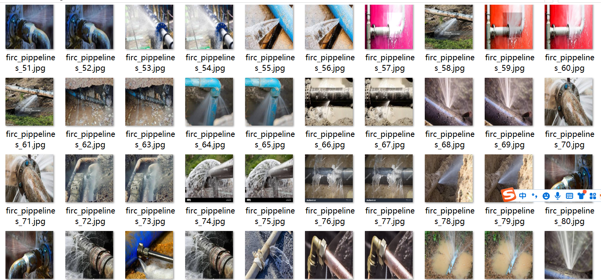
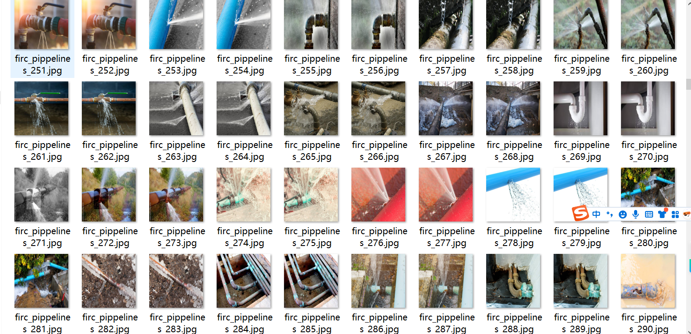
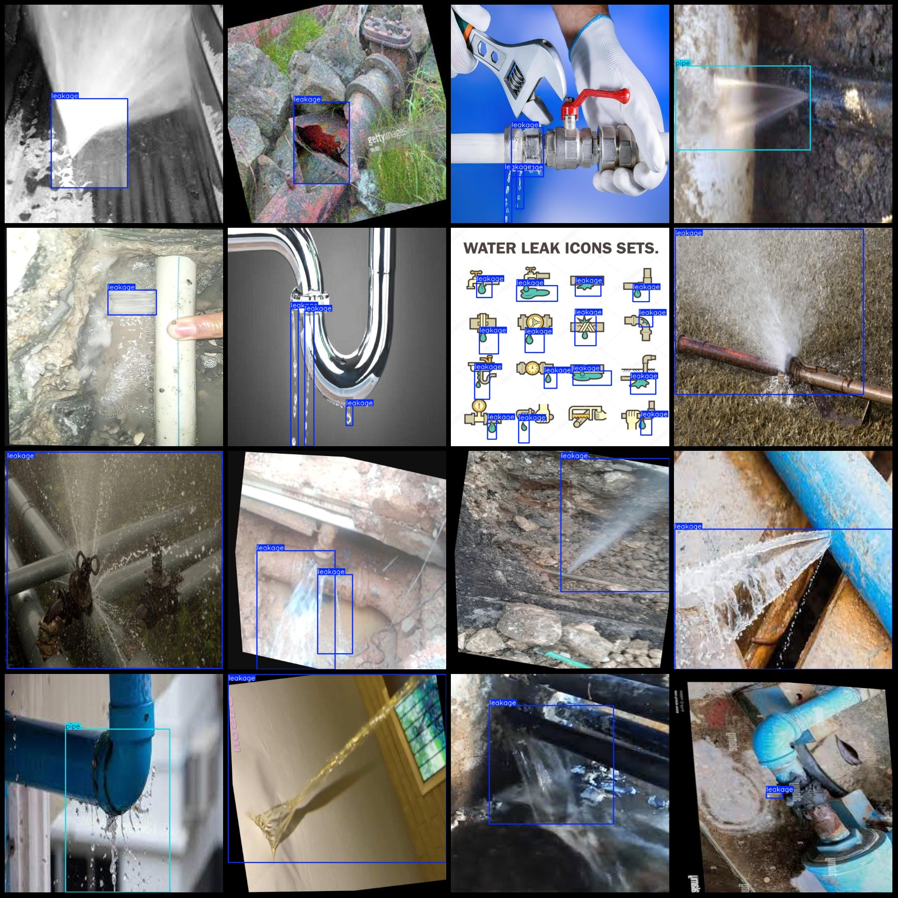
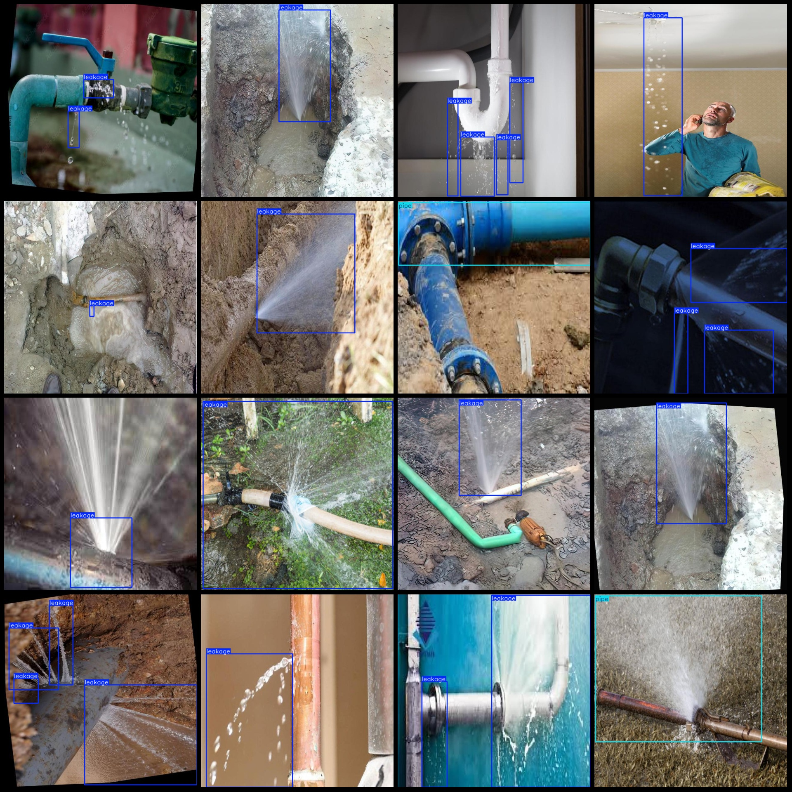

# Water Pipe Leakage and Crack Detection Dataset: VOC+YOLO Format with 1131 Images in 3 Categories

Please note that half of the images are enhanced. Please watch the image preview.

The dataset format is Pascal VOC format + YOLO format (excluding the split path's txt file, only containing jpg images along with corresponding VOC format xml files and yolo format txt files).

Number of images (jpg file counts): 1131
Number of annotations (xml file counts): 1131
Number of annotations (txt file counts): 1131
Number of annotation categories: 3
Annotation category names (note that the order of categories in the yolo format does not correspond to this, but rather, the labels folder's classes.txt for reference): ["cracks", "leakage", "pipe"]
Each category has a number of bounding boxes:
cracks (Cracks) = 35
leakage (Leakage) = 1438
pipe (Pipe) = 247
Total bounding box count: 1720
Image resolution: 640x640
Annotation tool used: labelImg
Annotation rules applied: drawing bounding boxes for each category
Important note: No specific statements have been made regarding accuracy guarantees for the trained models or weight files.
Special declaration: This dataset does not provide any assurance regarding the precision of the trained models or weight files.

Image Preview:

Annotation Example:

## Image

Here is a pay link on Stripe ( https://buy.stripe.com/3cs8yP7sY87d0vu9AB ). Please contact me lonlonago@foxmail.com after funding $89, and I will send you a complete data files , thank you!

